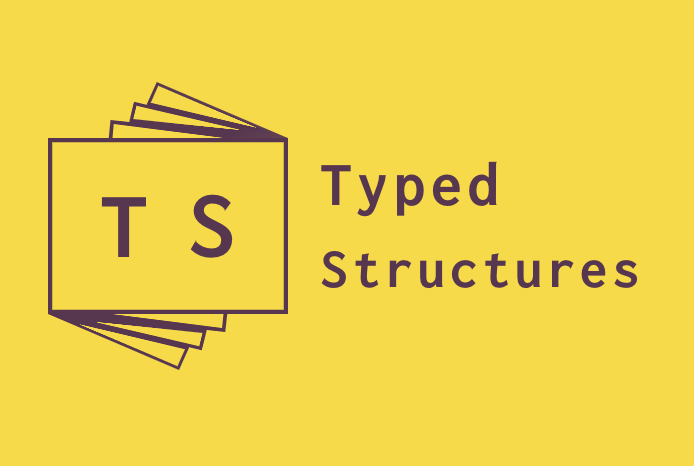

# TypedStructures

TypeScript implementation of data structures.

## Current features

 - [x] Singly linked list
 - [x] Doubly linked list
 - [x] Map
 - [x] Set
 - [x] Stack
 - [x] Queue
 - [x] Binary tree
 - [x] Buffer

